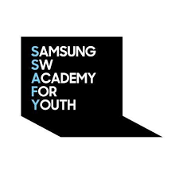
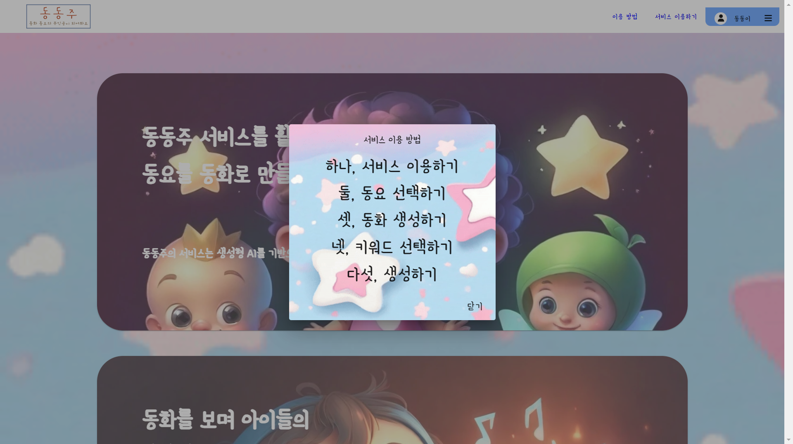
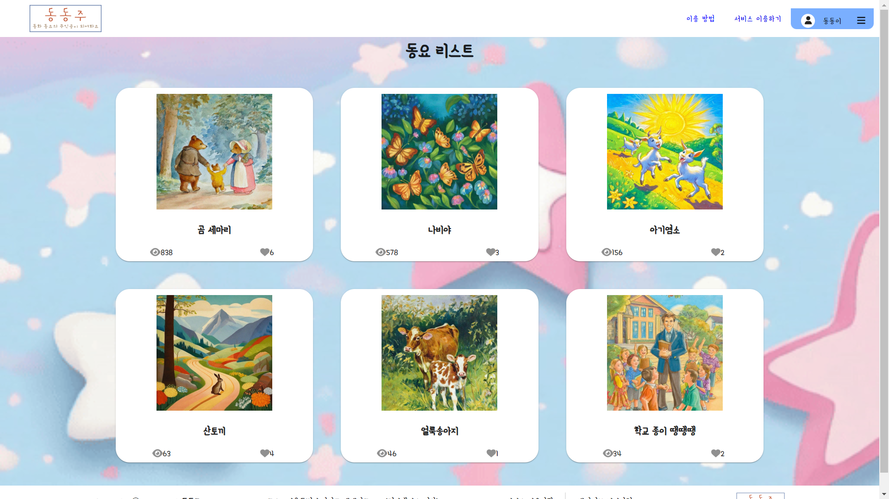
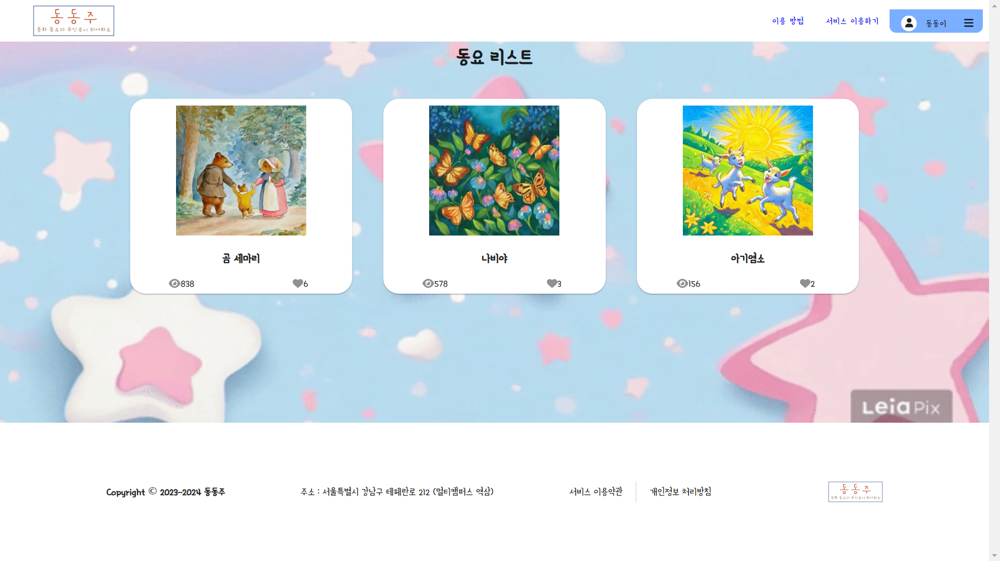
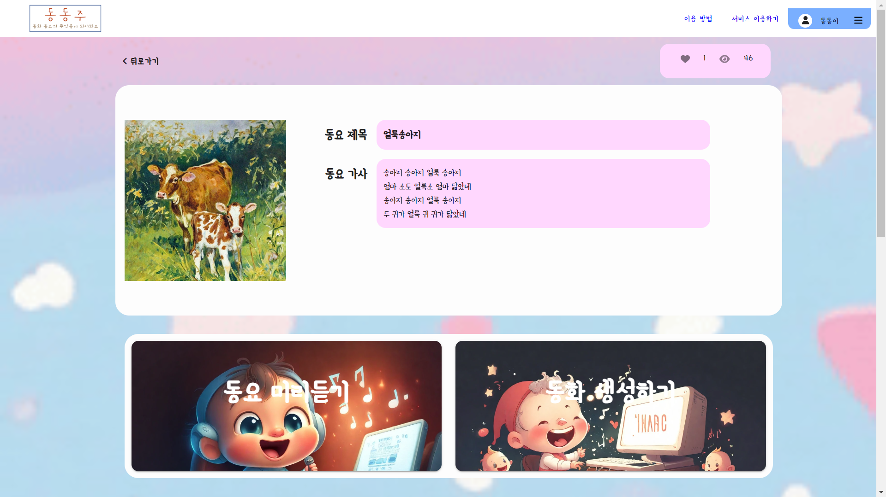
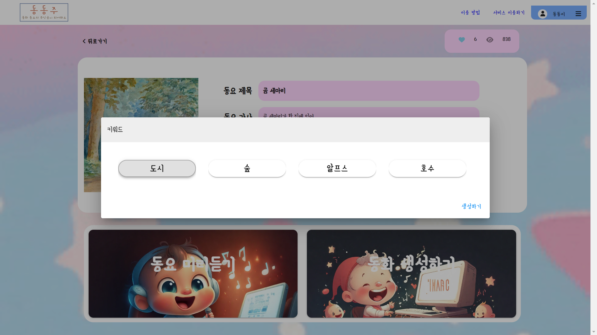

# SSAFY Project : 동동주

### 삼성청년소프트웨어아카데미(SSAFY) AI 특화 프로젝트

### 동동주 - 동화 동요의 주인공이 되어봐요

### 개발 기간 : 2024.02.26.~2024.04.04 (6주)

 
 

## 팀 구성

* [고승민](https://github.com/smink112) - 팀장, INFRA(서버 환경 구축), Backend (동요 리스트, 동요 상세, 좋아요, DB)
* [김기찬](https://github.com/TearofCoding) - 팀원, AI(prompt 커스터마이징), Backend (동요 기반 동화 생성)
* [박현우](https://github.com/gogoadl) - 팀원, Backend (메인 페이지, 로그인 페이지, 동요 목록 페이지, 동요 상세 페이지)
* [유제훈](https://github.com/JehunYoo) - 팀원, Backend (인증, 로그인, 회원가입, 좋아요 동요 목록)
* [차승윤](https://github.com/sycha11) - 팀원, Frontend (동화 제작 페이지, 동화 페이지, 동요 좋아요 목록 페이지)

 
 

## 프로젝트 소개

:star: 동요를 들을 때, 청각적요소 뿐만 아니라 시각적 요소가 동반된다면 아이들이 동요를 더 잘 들을 수 있단 생각에 시작하였습니다.

:star: 사용자가 직접 제공된 동요를 선택하고 선택한 키워드를 바탕으로 새로운 이미지를 생성하여 이미지와 함께 동요를 재생할 수 있는 서비스를 개발하였습니다.

 
 

## 프로젝트 주요 기능

:star: 동요를 바탕으로 동화책의 이미지를 제공합니다.

:star: 사용자가 선택한 태그에 따라서 동화를 생성합니다.

  
  

## 시연 영상

<video width="800" controls>
  <source src="./exec/images/동동주_UCC.mp4" type="video/mp4">
</video>

     

## 페이지 구성

Landing Page

  

Login Page

  

User Guide

  

Song List Page

  

Song Like List Page

  

Song Detail Page

  

Story Create

  

Story Loading Page

  

Story Page

     

## 사용 기술 스택
 간편한 설정, 객체 지향 프로그래밍

 인증, 로그인

  객체 지향 프로그래밍

   가볍고 유연한 프론트엔드 프레임워크

 그리드 시스템 사용을 위해 채택

 오류 검출 및 유지보수성 향상을 위해 채택

 동화책을 넘기는 UI를 표현하기 위해 사용

 기본 서버 데이터베이스로 사용하여 데이터를 안전하게 저장, 관리

 토큰 저장

 CI/CD 구축

 Vue Client Server, SpringBoot Server 배포

 이미지, 컨테이너 등을 활용하여 편리한 서버 환경 구축

 
 

## 시스템 아키텍처

* 접근하기 쉽고 유해 컨텐츠 자동 차단이 가능한 Karlo 사용
* Docker로 Nginx, Vue Client Server 배포
* MySQL을 기본 서버 데이터베이스로 사용하여 사용자 데이터를 안전하게 저장, 관리
* Redis를 도커 컨테이너로 배포, Token을 저장 및 관리
* GitLab과 Jenkins를 통한 CI/CD
* 전체적인 서버는 EC2 인스턴스를 사용하여 호스팅

 
 

## ERD

    

## 프로젝트 회고

* 사용자의 페르소나를 고려한 UI/UX를 설계하였습니다.

* 타입스크립트 활용 및  vuetify와 grid에 대해서 더 이해할 수 있었으며, front-end 파트에서 발생하는 다양한 이슈를 겪을 수 있었습니다.

* Prompt 최적화가 잘 이루어져 **일관성있는 이미지가 생성**됩니다.

* Spring Security와 MVC의 **역할과 책임을 명확하게 분리**하여 인증을 구현하였습니다.

* 노래 하나를 추가하게 된다면 가사와 가사키워드의 튜플이 상당히 많아지는데, 이를 **RDB 대신 NoSQL을 사용했다면**, 가사와 프롬프트 등을 저장하는데에 있어서 더 유리했을수 있었다는 생각이 듭니다.

* 초기에 기획한 **사용자 이미지와 생성된 이미지를 합성**하여 **사용자가 주인공이 되는 기능**이 Karlo의 일부 서비스가 종료되어 구현하지 못한 점이 아쉽습니다.

* 사용자의 상상력을 자극하기 위해서 사용자가 직접 태그를 입력하여 prompt를 생성하고자 하였습니다. 하지만 완벽한 Pipeline 구축이 어려워 이를 실현시키지 못한 점이 아쉽습니다.

* **INFRA 구축시 시스템 환경 설정**에 있어 각 프로젝트 요소들의 설계가 중요성하다는 것을 깨달았습니다.